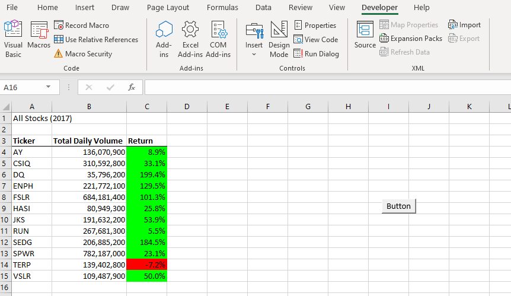
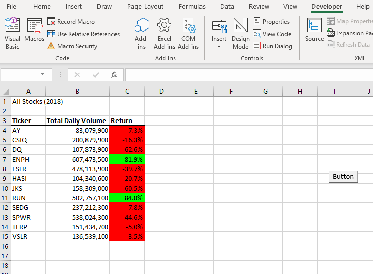

# Module 2 | Assignment - Wall Street

# Explore green energy stock performance by analyzing financial data using VBA.
# Overview of Project: Explain the purpose of this analysis.
Steve wants to help parents with investing in green energy. Even though his parents wanted to invest in DAQO green energy (Solar energy). Steve wants to look at all green energy companies in 2017 and 2018 and decide which kinds of energy are better for future investment. Here we using VBA to show all green enery performance in 2017 and 2018.
# Results: Using images and examples of your code, compare the stock performance between 2017 and 2018, as well as the execution times of the original script and the refactored script.

 From these two results, in 2017, Indeed DQ had a better future in which increased the total Volume and high percentage of return values. However, in 2018, the picture is slightly different in which the other two Green energy stocks had a better view, including ENPH and RUN. DQ had negative results, lowing total Volumes and negative returning, which means stock value dropped significantly. ENPH is a relatively stable stock with a positive increase in both 2017 and 2018. Run had a dramatic change from 2017 to 2018; it has positive growth. DQ was dropped for some reason. 
# Summary: In a summary statement, address the following questions.
In summary, we don't really suggest Steve's parent to invest DQ continuously. They probably think about RUN or best choice so far is ENPH. 
# What are the advantages or disadvantages of refactoring code?
Advantages : avoid reduplication such as don't repreat yourself rules. Disadvantage: for beginner i stick on step by step learning.
# How do these pros and cons apply to refactoring the original VBA script?
save time 
# My comments on Module 2
I did not use the tickerIndex since my code did not work. It worked neither return nor total Volume. Total Volume came out but with the wrong calculations. So I combined individual code for practicing 2018 and combined teh code with provided code given by Bootcamp. However, I understood my code and reached the goal. The Ticker Index code was provided in slackflows and I don't want to use it.